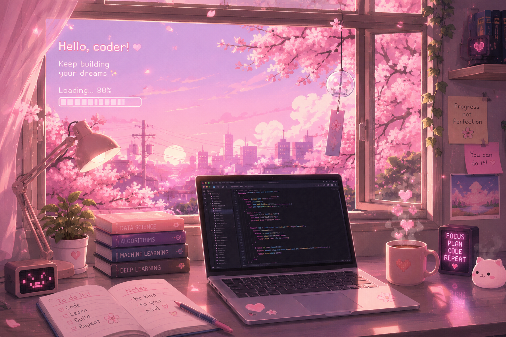

# Hi, I'm Hiba 👋

### AI & Data Science Engineering Student | Software Engineer | Lifelong Learner

Passionate about building intelligent, impactful software — currently deep in AI/ML while sharpening my engineering fundamentals.

  

---

## 🎓 About Me

- 🎓 AI & Data Science Engineering Student at **ESI Sidi Bel Abbès**
- 💻 Passionate about software engineering and artificial intelligence
- 🚀 Interested in building impactful and intelligent applications
- 🌱 Always learning new technologies and improving my skills
- 🤝 Open to collaboration, research, and internship opportunities

---

## 🛠️ Tech Stack

**Languages**

**AI & Data Science**

**Mobile Development**

**Backend Development**

**Databases**

**Tools & Technologies**

---

## 🌱 Current Interests

- Artificial Intelligence
- Data Science
- Computer Vision
- Natural Language Processing
- IoT
- Software Engineering

---

## 🚧 Projects

I'm currently organizing my project portfolio properly — polished write-ups and repos are on their way. Check back soon!

---

*Thanks for stopping by — let's build something great together!*

